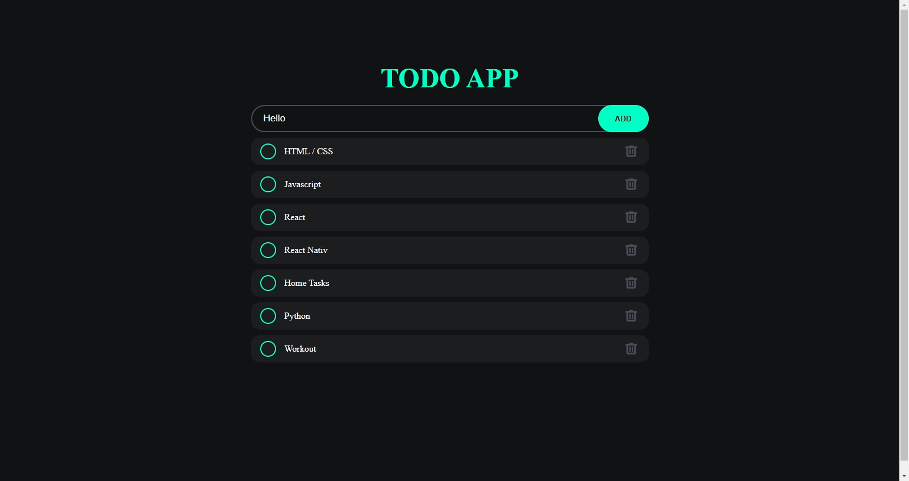
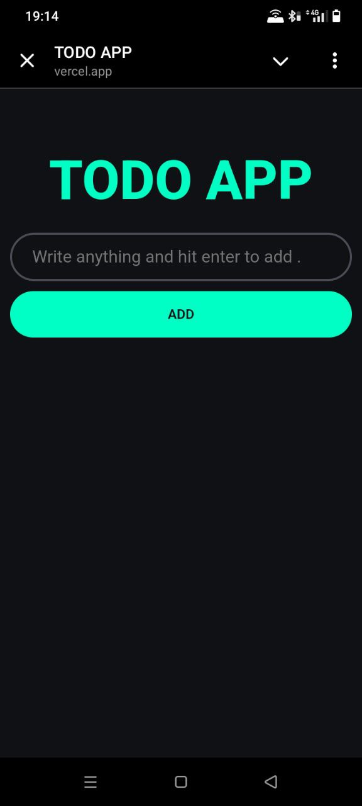

# TODO List App

This is a simple TODO List application built using **HTML**, **CSS**, and **JavaScript**. The app allows users to manage their tasks by adding, deleting, and marking them as completed.

## Features

- **Add tasks:** Users can add new tasks to their list.
- **Delete tasks:** Remove tasks that are no longer needed.
- **Mark tasks as completed:** Mark tasks as done with a single click.
- **Sync functionality:** The app maintains data synchronization.

## Live Demo

Check out the live app here:  
👉 [TODO App](https://sync-todo-app.vercel.app/)

## Screenshots

### Desktop View  

### Mobile View  

## How to Use

1. Add tasks by typing in the input field and clicking **ADD**.
2. Mark tasks as completed by selecting the checkbox next to them.
3. Delete tasks by clicking the trash icon.

## Technologies Used

- **HTML5:** For the structure.
- **CSS3:** For styling and layout.
- **JavaScript:** For app functionality.
- **Hosting:** The app is hosted on [Vercel](https://vercel.com).

---

Let me know if you need further adjustments! 😊
